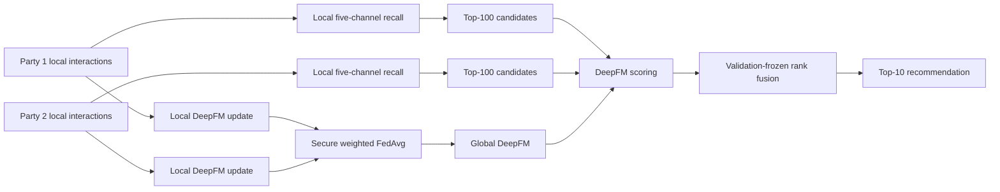

# Federated DeepFM Recommender

> A privacy-preserving, multi-stage movie recommendation pipeline: **local hybrid recall → horizontal federated DeepFM → validation-frozen Top-10 ranking**.

[中文面试手册](docs/INTERVIEW_GUIDE.md) · [实验协议](docs/EXPERIMENT_PROTOCOL.md) · [简历描述与技术栈](docs/RESUME_PROJECT.md)

## Why this project

Real recommendation systems do not score the entire catalog with a heavy ranking model. They first retrieve a small candidate set, then run a more expressive ranker. This project implements that complete path under horizontal federated learning:

- two parties keep interaction rows locally and share the same feature schema;
- each party builds retrieval signals from its own history;
- a SecretFlow `FLModel` trains DeepFM with weighted FedAvg and secure aggregation;
- validation chooses a small, predeclared DeepFM/retrieval rank blend and freezes it before test;
- test labels never participate in recall, model features, fusion selection, or ranking.

## Recorded results

The primary retained run uses MovieLens 100K, 270 high-intent users, a controlled 500-item mother pool, natural recall to 100 candidates, and Top-10 ranking.

| Experiment | Users | Precision@10 | Recall@10 | HitRate@10 | NDCG@10 | Candidate AUC |
|---|---:|---:|---:|---:|---:|---:|
| Primary retained run | 270 | 20.30% | 28.49% | **91.11%** | 29.77% | 75.35% |
| High-intent milestone | 132 | 20.91% | 27.25% | **93.94%** | 28.65% | 74.70% |
| User-expansion stress test | 419 | 20.74% | 29.24% | 89.98% | 29.71% | **76.49%** |

The expansion result is intentionally reported: the system retained stronger global discrimination while losing two Top-10 hit users, showing why AUC and HitRate must be optimized and interpreted separately. Machine-readable records are in [`results/benchmark_results.json`](results/benchmark_results.json).

> **Evaluation boundary:** in `controlled_500` mode, held-out interactions are guaranteed only in the 500-item mother pool. They are **not** injected into recalled Top-100 or ranked Top-10. This is a controlled offline candidate-set benchmark, not an unbiased production full-catalog estimate. Set `candidate_mode` to `full_catalog` for a production-like stress test.

## Architecture



## Algorithm

### 1. Party-local hybrid recall

Every legal unseen movie receives five label-free scores built only from the current party's training history:

| Channel | Weight | Purpose |
|---|---:|---|
| Smoothed popularity | 15% | Stable fallback for sparse users/items |
| Positive ItemCF | 35% | Co-occurrence among positively rated movies |
| Genre content | 15% | Match the user's positive genre profile |
| Signed ItemCF | 5% | Include explicit negative feedback in item similarity |
| UserCF | 30% | Transfer preference from similar local users |

Each channel is min-max normalized within the user's legal candidate universe. The weighted score returns Top-100 candidates.

### 2. Robust DeepFM training

DeepFM combines:

- a linear term for first-order feature effects;
- FM pairwise embedding interactions;
- a multilayer network for high-order nonlinear interactions.

The model excludes raw user-ID embedding to reduce memorization. Training uses explicit feedback plus label-free sampled negatives with a 50/30/10/10 mix of retrieval-hard, same-interest, local-popularity, and deterministic-random items. Held-out explicit interactions are excluded from negative sampling.

### 3. Horizontal federation

Both parties train the same TensorFlow model locally. SecretFlow `fed_avg_w` aggregates model updates by local sample count. `SecureAggregator` protects intermediate aggregation in the simulation workflow. See the official SecretFlow documentation for [horizontal FL](https://secretflow.readthedocs.io/en/stable/tutorial/Federate_Learning_for_Image_Classification.html), [strategy design](https://secretflow.readthedocs.io/en/stable/developer/design/strategy.html), and [secure aggregation limitations](https://secretflow.readthedocs.io/en/stable/developer/algorithm/secure_aggregation.html).

### 4. Validation-frozen ranking

DeepFM probability and retrieval score have different scales, so the pipeline converts each to a per-user percentile rank. Validation compares only six predeclared blends. A blend must strictly improve validation HitRate@10 over pure federated DeepFM; otherwise the pipeline falls back to pure DeepFM. The selected plan is frozen before test.

## Repository layout

```text
src/fedrec/
├── data.py          # MovieLens loading, cohort selection, fixed holdout, party split
├── retrieval.py     # popularity + ItemCF + content + signed ItemCF + UserCF
├── features.py      # party-local profiles and robust negative sampling
├── deepfm.py        # TensorFlow DeepFM and hybrid BCE/Focal loss
├── federated.py     # SecretFlow FedAvgW training and prediction
├── ranking.py       # validation-only rank-fusion selection
├── metrics.py       # Precision/Recall/HitRate/NDCG/AUC
└── pipeline.py      # end-to-end experiment orchestration
```

## Quick start

The validated cloud environment was Python 3.10.16, TensorFlow 2.12.0, and SecretFlow 1.11.0b1.

```bash
python -m venv .venv
.venv/Scripts/activate
pip install -e ".[federated,dev]"
```

Download MovieLens 100K from the official [GroupLens page](https://grouplens.org/datasets/movielens/100k/) and extract it to `data/raw/ml-100k/`.

Audit preprocessing and candidate generation without federated training:

```bash
python scripts/run_experiment.py \
  --raw-dir data/raw/ml-100k \
  --work-dir outputs/movielens_100k \
  --prepare-only
```

Run the complete experiment inside the SecretFlow kernel:

```bash
python scripts/run_experiment.py \
  --raw-dir data/raw/ml-100k \
  --work-dir outputs/movielens_100k
```

You can also open [`notebooks/run_movielens.ipynb`](notebooks/run_movielens.ipynb).

## Reproducibility and privacy notes

- Stable SHA-256 ordering controls user-party assignment, holdout selection, candidate sampling, and negative sampling.
- Validation/test are fixed per-user holdouts with both positive and explicit-negative feedback.
- Recall weights are fixed before test; final fusion is selected on validation only.
- Candidate source, candidate position, target labels, and raw user IDs are not DeepFM inputs.
- This repository simulates two parties on one machine. A production deployment still needs identity alignment, transport security, access control, privacy accounting, monitoring, and a reviewed secure-aggregation backend.
- Raw MovieLens data, processed data, model artifacts, and prediction outputs are excluded from Git.

## Tests

```bash
pip install -e ".[dev]"
pytest -q
```

The tests cover fixed holdout invariants, controlled-pool boundaries, unique natural recall, and validation-only fusion selection without requiring TensorFlow or SecretFlow.

## Tech stack

Python · Pandas · NumPy · TensorFlow/Keras · SecretFlow/SecretFlow-FL · DeepFM · ItemCF/UserCF · Federated Averaging · Secure Aggregation · Jupyter · Pytest

## License

Code is released under the MIT License. MovieLens data is not redistributed; follow the terms published by GroupLens.

